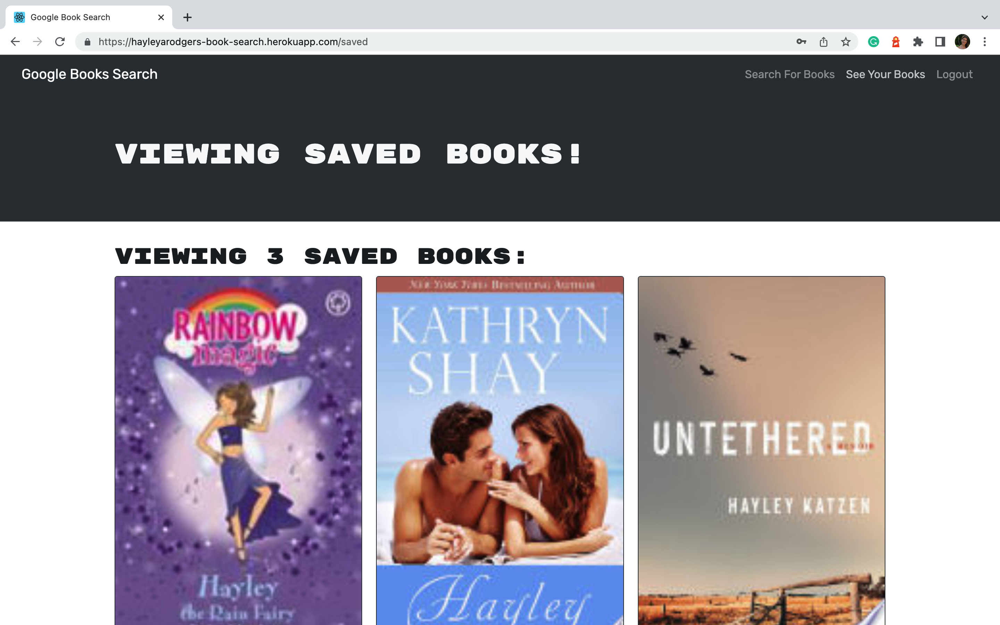

# book-search-engine

## Table of Contents

* [Description](#description)
* [Access](#access)
* [Installation](#installation)
* [Usage](#usage)
* [Credits](#credits)

## Description

My goal for this project was to take a fully functioning Google Books API search engine built with a RESTful API, and refactor it to be a GraphQL API built with Apollo Server.

### User Story

```
AS AN avid reader
I WANT to search for new books to read
SO THAT I can keep a list of books to purchase
```

### Tools and Technologies Used

To refactor this application, I used:
- GraphQL
- apollo-server-express
- @apollo/client
- jsonwebtoken
- jwt-decode
- And, Heroku.

### Screenshot of Application



## Access

### Code Repository

The repository where the code is saved is on Github. To access it, click [here](https://github.com/hayleyarodgers/book-search-engine).

### Live Application

My application is deployed on Heroku. To access it, click [here](https://hayleyarodgers-book-search.herokuapp.com/).

## Installation

To install necessary dependencies, run the following command:

```
npm i
```

## Usage

To use the application from the command line (after installing dependencies):
1. Open the root directory of the repository in your terminal or bash.
2. Bundle the front-end code by entering ```npm run build``` in the command line.
3. Start the server by entering ```npm run start``` in the command line and go to the port on your local host OR use the complete application by entering ```npm run develop``` in the command line and go to the port on your local host.

Alternatively, to use the live application, click [here](https://hayleyarodgers-book-search.herokuapp.com/).

## Credits

- This is the [starter code](https://github.com/coding-boot-camp/solid-broccoli) I used.